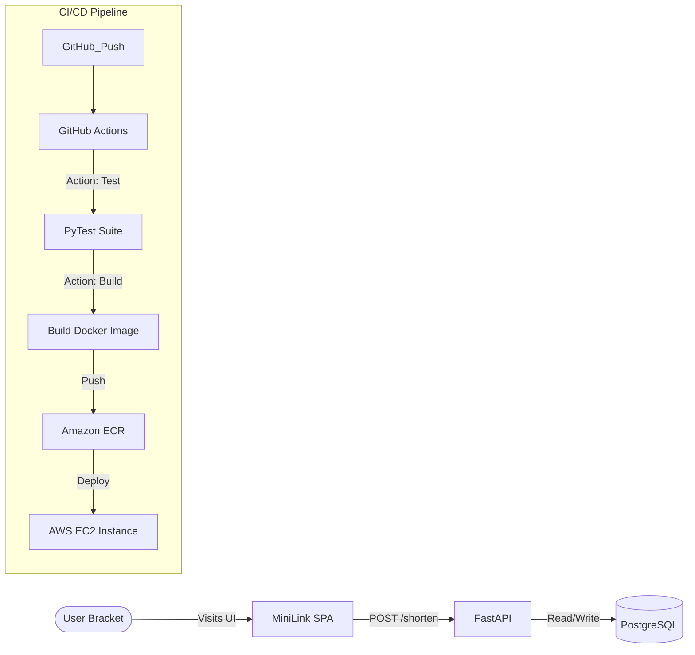

# 🔗 MiniLink — Premium URL Shortener & DevOps Project

A production-ready URL shortening service built with **FastAPI + PostgreSQL**, featuring a sleek **Dark Glassmorphism** frontend. The infrastructure is entirely provisioned on AWS using **Terraform (IaC)**, and continuous deployment is automated via **GitHub Actions (CI/CD)**.

Currently Live at: [http://13.212.205.51](http://13.212.205.51)

## 🌟 Key Features

- **Blazing Fast API**: Powered by FastAPI (Python 3.12) and SQLAlchemy.
- **Premium User Interface**: A modern, responsive Single Page Application with a "Dark Glassmorphism" aesthetic.
- **Robust Database**: Uses PostgreSQL 16 on production and in-memory SQLite for rapid CI testing.
- **Automated CI/CD**: Zero-downtime deployment pipeline to Amazon EC2 via Docker Compose.
- **Infrastructure as Code**: One-click AWS environment setup (VPC, Security Groups, IAM, EC2, ECR) via Terraform.

---

## 🏗️ Architecture



---

## 🛠️ Tech Stack

| Layer | Technology |
|---|---|
| **Frontend** | HTML5, Vanilla CSS (Glassmorphism), JavaScript (Fetch API) |
| **Backend** | FastAPI, Python 3.12, Uvicorn |
| **Database** | PostgreSQL 16 |
| **Containerization**| Docker & Docker Compose (v2) |
| **Infrastructure** | Terraform >= 1.7 |
| **CI/CD** | GitHub Actions |
| **Cloud Provider** | AWS (EC2, ECR, IAM, VPC) |

---

## 📡 API Endpoints

| Method | Path | Description |
|---|---|---|
| `GET` | `/` | Serve the MiniLink Frontend UI |
| `GET` | `/health` | Application Health check |
| `POST` | `/shorten` | Shorten a provided URL |
| `GET` | `/{short_code}` | Redirect to the original URL (404 if not found) |
| `GET` | `/stats/{short_code}` | Get click statistics for a short URL |

---

## 🚀 Local Development

```bash
# 1. Clone the repository
git clone https://github.com/sukinomatsuri/url-shortener.git
cd url-shortener

# 2. Start the services with Docker Compose
docker compose up --build

# 3. View the Frontend App
# Open http://localhost:8000/ in your browser

# 4. Open Interactive API Docs (Swagger UI)
# Open http://localhost:8000/docs
```

---

## 🧪 Running Tests Locally

```bash
# Install dependencies
pip install -r app/requirements.txt pytest httpx

# Run the test suite (uses SQLite in-memory DB)
pytest tests/ -v
```

---

## ☁️ AWS Deployment Guide

### Prerequisites
* AWS CLI configured (`aws configure` with an IAM User that has Admin permissions)
* Terraform >= 1.7 installed
* SSH key pair generated at `~/.ssh/id_rsa`

### Step 1 — Provision Infrastructure (Terraform)
This step will automatically create a VPC, Internet Gateway, Subnet, Security Groups, IAM Roles, an ECR Registry, and an EC2 Instance.

```bash
cd terraform
terraform init
terraform plan
terraform apply
```

### Step 2 — Configure GitHub Secrets
In your GitHub repository, go to **Settings** → **Secrets and variables** → **Actions**, and add the following repository secrets:

| Secret Name | Value | Description |
|---|---|---|
| `AWS_ACCESS_KEY_ID` | `AKIA...` | From your AWS IAM User |
| `AWS_SECRET_ACCESS_KEY` | `...` | From your AWS IAM User |
| `EC2_HOST` | e.g. `13.212.x.x` | The EC2 public IP (outputted by Terraform) |
| `EC2_SSH_KEY` | `-----BEGIN RSA...` | The entire content of your `~/.ssh/id_rsa` file |

*(Note: `ECR_REGISTRY` is automatically resolved during the CI/CD pipeline and does not need to be manually provided!)*

### Step 3 — Deploy (Continuous Delivery)
Simply commit and push your code to the `main` branch. GitHub Actions will handle the rest:

```bash
git add .
git commit -m "feat: amazing update"
git push origin main
```
Watch the "Actions" tab on GitHub. In roughly 2 minutes, your updated application will be live on your EC2 instance!
