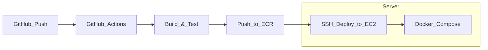

# URL Shortener — DevOps Project

A production-ready URL shortening service built with **FastAPI + PostgreSQL**, deployed on AWS using **Terraform (IaC)** and **GitHub Actions (CI/CD)**.

## Architecture



## Tech Stack

| Layer | Technology |
|---|---|
| App | FastAPI (Python 3.12) |
| Database | PostgreSQL 16 |
| Container | Docker + Docker Compose |
| Registry | AWS ECR |
| Compute | AWS EC2 (t3.micro) |
| IaC | Terraform 1.7+ |
| CI/CD | GitHub Actions |

## API Endpoints

| Method | Path | Description |
|---|---|---|
| GET | `/health` | Health check |
| POST | `/shorten` | Shorten a URL |
| GET | `/{short_code}` | Redirect to original URL |
| GET | `/stats/{short_code}` | Get click stats for a short URL |

## Local Development

```bash
# 1. Clone the repo
git clone https://github.com/sukinomatsuri/url-shortener
cd url-shortener

# 2. Start with Docker Compose
docker compose up --build

# 3. Test the API
curl -X POST http://localhost:8000/shorten \
  -H "Content-Type: application/json" \
  -d '{"url": "https://www.google.com"}'

# 4. Open interactive docs
# Go to http://localhost:8000/docs in your browser
```

## Running Tests

```bash
pip install -r app/requirements.txt pytest httpx
pytest tests/ -v
```

## AWS Deployment

### Prerequisites

*   AWS CLI configured (`aws configure`)
*   Terraform >= 1.7 installed
*   SSH key pair at `~/.ssh/id_rsa`

### Step 1 — Provision infrastructure

```bash
cd terraform
terraform init
terraform plan
terraform apply
```
*This creates: VPC, Subnet, Internet Gateway, Security Group, EC2, IAM Role, ECR.*

### Step 2 — Add GitHub Secrets

In your repo → **Settings** → **Secrets and variables** → **Actions**, add:

| Secret Name | Value |
|---|---|
| `AWS_ACCESS_KEY_ID` | From IAM user |
| `AWS_SECRET_ACCESS_KEY` | From IAM user |
| `EC2_HOST` | EC2 public IP (from terraform output) |
| `EC2_SSH_KEY` | Contents of `~/.ssh/id_rsa` |
| `ECR_REGISTRY` | ECR registry URL (from terraform output) |

### Step 3 — Deploy

Push to `main` branch — GitHub Actions handles the rest automatically.

```bash
git add .
git commit -m "Deploy to AWS"
git push origin main
```
